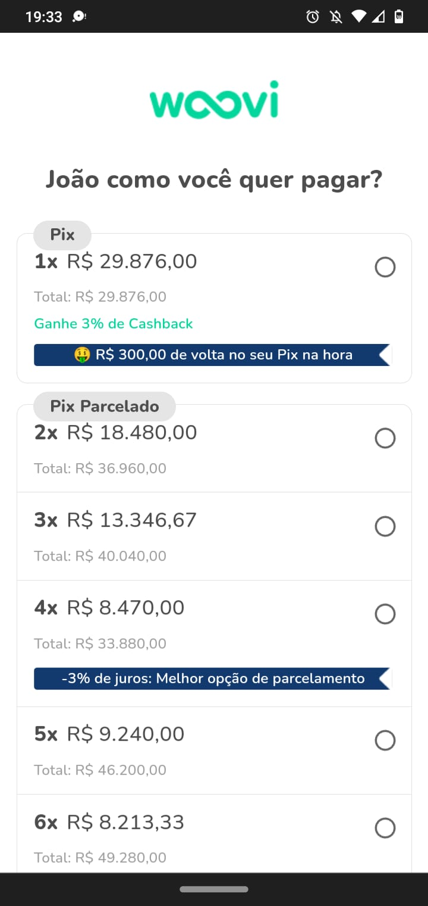
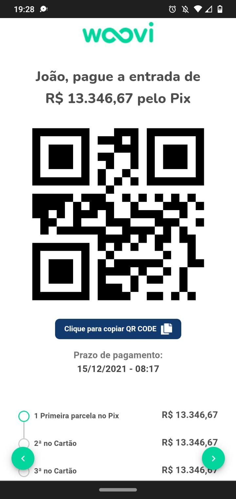
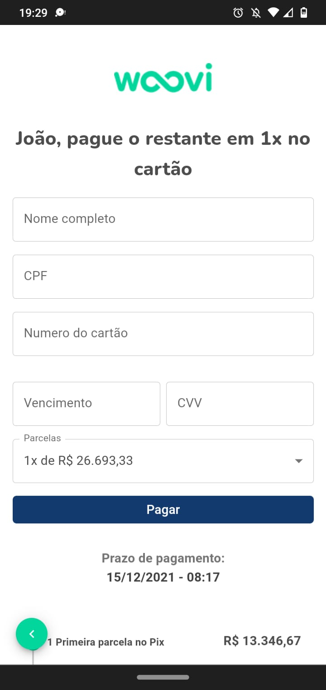

# Code challenge telas de pagamento

This challenge is an implementation of the payments part of a mobile first app

<!-- image -->

## Screenshots

  
  
  

## Features

- [x] Listing of installment amount
- [x] QRCode generation (There is no PIX implementation itself, it is just the value of the installment)
- [x] Masks in card registration inputs (card number, expiration date and security code, CPF)

## Technologies

- [React Native](https://reactnative.dev/)
- [TypeScript](https://www.typescriptlang.org/)
- [MUI](https://mui.com/)

## How to run

1. Clone the repository
2. Enter the repository folder
   ` cd woovi-code-challenge`
3. Install the dependencies with `yarn`
4. Run the project with `yarn dev` or `yarn dev`
5. Access the application at `http://localhost:5173`
